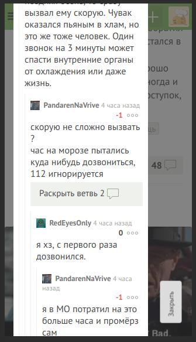

simple browser extension for fast reading comments on pikabu

    1. Copy cs.js, jq.js, manifest.json to device folder ( to /sdcard/Downloads/ext)
    2. Download yandex browser
    3. Go to chrome://extensions
    4. Load unpacked - select folder (/sdcard/Downloads/ext). Extension added!
    5. Open any pikabu newsfeed. Enjoy!
    
Example
=========

